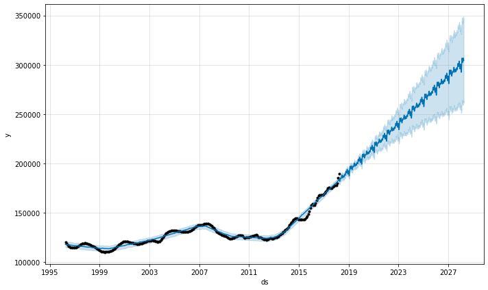
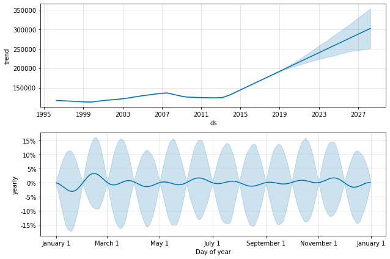
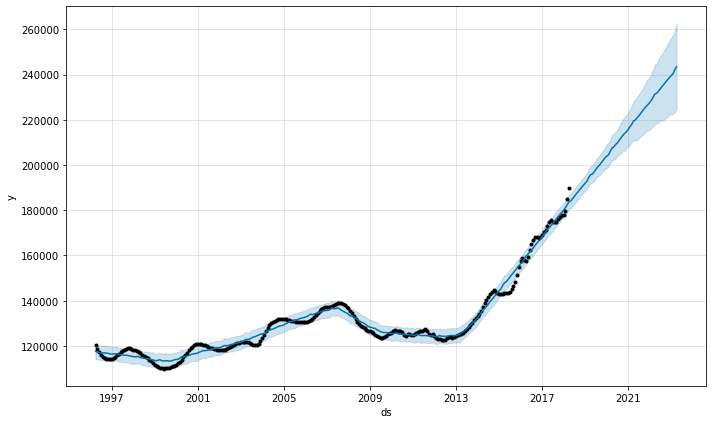
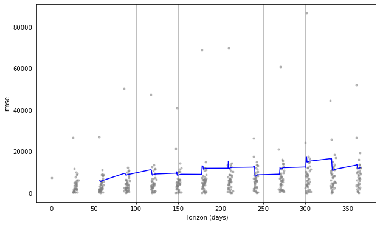

```python
from fbprophet import Prophet
import pandas as pd
import matplotlib.pyplot as plt
from sklearn.metrics import mean_squared_error, r2_score, mean_absolute_error
```


```python
df=pd.read_csv('df_zillow_77036_prepped_fbprophet.csv')

# df = pd.read_csv('../examples/example_retail_sales.csv')
m = Prophet(seasonality_mode='multiplicative').fit(df)
future = m.make_future_dataframe(periods=3652)
fcst = m.predict(future)
fig = m.plot(fcst)
```

    INFO:fbprophet:Disabling weekly seasonality. Run prophet with weekly_seasonality=True to override this.
    INFO:fbprophet:Disabling daily seasonality. Run prophet with daily_seasonality=True to override this.
    

    
    


    

    


```python
m = Prophet(seasonality_mode='multiplicative', mcmc_samples=300).fit(df)
fcst = m.predict(future)
fig = m.plot_components(fcst)
```

    INFO:fbprophet:Disabling weekly seasonality. Run prophet with weekly_seasonality=True to override this.
    INFO:fbprophet:Disabling daily seasonality. Run prophet with daily_seasonality=True to override this.
    WARNING:pystan:n_eff / iter below 0.001 indicates that the effective sample size has likely been overestimated
    WARNING:pystan:Rhat above 1.1 or below 0.9 indicates that the chains very likely have not mixed
    WARNING:pystan:534 of 600 iterations saturated the maximum tree depth of 10 (89 %)
    WARNING:pystan:Run again with max_treedepth larger than 10 to avoid saturation
    C:\Users\booos\anaconda3\envs\learn-env\lib\site-packages\fbprophet\plot.py:422: UserWarning: FixedFormatter should only be used together with FixedLocator
      ax.set_yticklabels(yticklabels)
    


    

    


```python
future = m.make_future_dataframe(periods=60, freq='MS')
fcst = m.predict(future)
fig = m.plot(fcst)


# We don't do seasonality because fbprophet uses the first of each month. If we had daily data maybe we can approach that.
```


    

    


```python
fcst[['ds', 'yhat', 'yhat_lower', 'yhat_upper']].tail()
```


<div>
<style scoped>
    .dataframe tbody tr th:only-of-type {
        vertical-align: middle;
    }

    .dataframe tbody tr th {
        vertical-align: top;
    }

    .dataframe thead th {
        text-align: right;
    }
</style>
<table border="1" class="dataframe">
  <thead>
    <tr style="text-align: right;">
      <th></th>
      <th>ds</th>
      <th>yhat</th>
      <th>yhat_lower</th>
      <th>yhat_upper</th>
    </tr>
  </thead>
  <tbody>
    <tr>
      <th>320</th>
      <td>2022-12-01</td>
      <td>238719.156038</td>
      <td>222512.444986</td>
      <td>254791.595425</td>
    </tr>
    <tr>
      <th>321</th>
      <td>2023-01-01</td>
      <td>239560.736927</td>
      <td>222373.261264</td>
      <td>256238.644848</td>
    </tr>
    <tr>
      <th>322</th>
      <td>2023-02-01</td>
      <td>240416.887571</td>
      <td>222696.558514</td>
      <td>257438.135370</td>
    </tr>
    <tr>
      <th>323</th>
      <td>2023-03-01</td>
      <td>242072.143092</td>
      <td>223247.088414</td>
      <td>259397.395852</td>
    </tr>
    <tr>
      <th>324</th>
      <td>2023-04-01</td>
      <td>243500.915973</td>
      <td>224834.345791</td>
      <td>262507.688218</td>
    </tr>
  </tbody>
</table>
</div>


```python
metric_df = fcst.set_index('ds')[['yhat']].join(df.set_index('ds').y).reset_index()
```


```python
metric_df.tail()
metric_df.dropna(inplace=True)
```


```python
r2_score(metric_df.y, metric_df.yhat)
```


    0.9824681552567679


```python
mean_squared_error(metric_df.y, metric_df.yhat)
```


    4762310.875940383


```python
# df.columns
```


    Index(['ds', 'y'], dtype='object')


```python

```


```python
# df
```


```python
# df.plot()
```


```python
# df.drop(columns=['Unnamed: 0'])
```


```python
# #ok it is ready for fbprophet

# Model = Prophet(interval_width=0.95)
```


```python
# Model.fit(df)
```


```python
# future_dates = Model.make_future_dataframe(periods=36, freq='MS')
# future_dates.tail()
```


```python
# forecast = Model.predict(future_dates)
# forecast.head()
```


```python
# forecast[['ds', 'yhat', 'yhat_lower', 'yhat_upper']].tail()
```


```python
# Model.plot(forecast, uncertainty=True);
# plt.show()
```


```python
# Model.plot_components(forecast);
```


```python
from fbprophet.diagnostics import cross_validation

cutoffs = pd.date_range(start='1996-04', end='2000-04', freq='1MS')
cutoffs

```


    DatetimeIndex(['1996-04-01', '1996-05-01', '1996-06-01', '1996-07-01',
                   '1996-08-01', '1996-09-01', '1996-10-01', '1996-11-01',
                   '1996-12-01', '1997-01-01', '1997-02-01', '1997-03-01',
                   '1997-04-01', '1997-05-01', '1997-06-01', '1997-07-01',
                   '1997-08-01', '1997-09-01', '1997-10-01', '1997-11-01',
                   '1997-12-01', '1998-01-01', '1998-02-01', '1998-03-01',
                   '1998-04-01', '1998-05-01', '1998-06-01', '1998-07-01',
                   '1998-08-01', '1998-09-01', '1998-10-01', '1998-11-01',
                   '1998-12-01', '1999-01-01', '1999-02-01', '1999-03-01',
                   '1999-04-01', '1999-05-01', '1999-06-01', '1999-07-01',
                   '1999-08-01', '1999-09-01', '1999-10-01', '1999-11-01',
                   '1999-12-01', '2000-01-01', '2000-02-01', '2000-03-01',
                   '2000-04-01'],
                  dtype='datetime64[ns]', freq='MS')


```python
# df_cv = cross_validation(model=Model, horizon='90 days')

cv_results = cross_validation( model = Model, initial = pd.to_timedelta(365,unit="d"), horizon = pd.to_timedelta(365,unit="d"))
```

    INFO:fbprophet:Making 41 forecasts with cutoffs between 1997-04-06 00:00:00 and 2017-04-01 00:00:00
    WARNING:fbprophet:Seasonality has period of 365.25 days which is larger than initial window. Consider increasing initial.
    


    HBox(children=(HTML(value=''), FloatProgress(value=0.0, max=41.0), HTML(value='')))


    INFO:fbprophet:n_changepoints greater than number of observations. Using 9.
    INFO:fbprophet:n_changepoints greater than number of observations. Using 14.
    

    
    

    INFO:fbprophet:n_changepoints greater than number of observations. Using 19.
    INFO:fbprophet:n_changepoints greater than number of observations. Using 23.
    

    
    


```python
cv_results.head()
```


<div>
<style scoped>
    .dataframe tbody tr th:only-of-type {
        vertical-align: middle;
    }

    .dataframe tbody tr th {
        vertical-align: top;
    }

    .dataframe thead th {
        text-align: right;
    }
</style>
<table border="1" class="dataframe">
  <thead>
    <tr style="text-align: right;">
      <th></th>
      <th>ds</th>
      <th>yhat</th>
      <th>yhat_lower</th>
      <th>yhat_upper</th>
      <th>y</th>
      <th>cutoff</th>
    </tr>
  </thead>
  <tbody>
    <tr>
      <th>0</th>
      <td>1997-05-01</td>
      <td>143092.652709</td>
      <td>139360.686719</td>
      <td>146902.384703</td>
      <td>116600.0</td>
      <td>1997-04-06</td>
    </tr>
    <tr>
      <th>1</th>
      <td>1997-06-01</td>
      <td>144053.822094</td>
      <td>134082.774089</td>
      <td>153857.711081</td>
      <td>117300.0</td>
      <td>1997-04-06</td>
    </tr>
    <tr>
      <th>2</th>
      <td>1997-07-01</td>
      <td>168248.130500</td>
      <td>148704.949557</td>
      <td>186021.515866</td>
      <td>117900.0</td>
      <td>1997-04-06</td>
    </tr>
    <tr>
      <th>3</th>
      <td>1997-08-01</td>
      <td>165634.811335</td>
      <td>138293.452853</td>
      <td>192479.993746</td>
      <td>118400.0</td>
      <td>1997-04-06</td>
    </tr>
    <tr>
      <th>4</th>
      <td>1997-09-01</td>
      <td>159651.119268</td>
      <td>120258.662358</td>
      <td>197438.172314</td>
      <td>118800.0</td>
      <td>1997-04-06</td>
    </tr>
  </tbody>
</table>
</div>


```python

# from fbprophet.diagnostics import performance_metrics
# df_p = performance_metrics(df_cv)
# df_p.head()
```


```python
from fbprophet.plot import plot_cross_validation_metric
fig = plot_cross_validation_metric(cv_results, metric='rmse')
```


    

    


```python
# df = pd.read_csv('../examples/example_retail_sales.csv')
# m = Prophet(seasonality_mode='multiplicative').fit(df)
# future = m.make_future_dataframe(periods=3652)
# fcst = m.predict(future)
# fig = m.plot(fcst)
```
